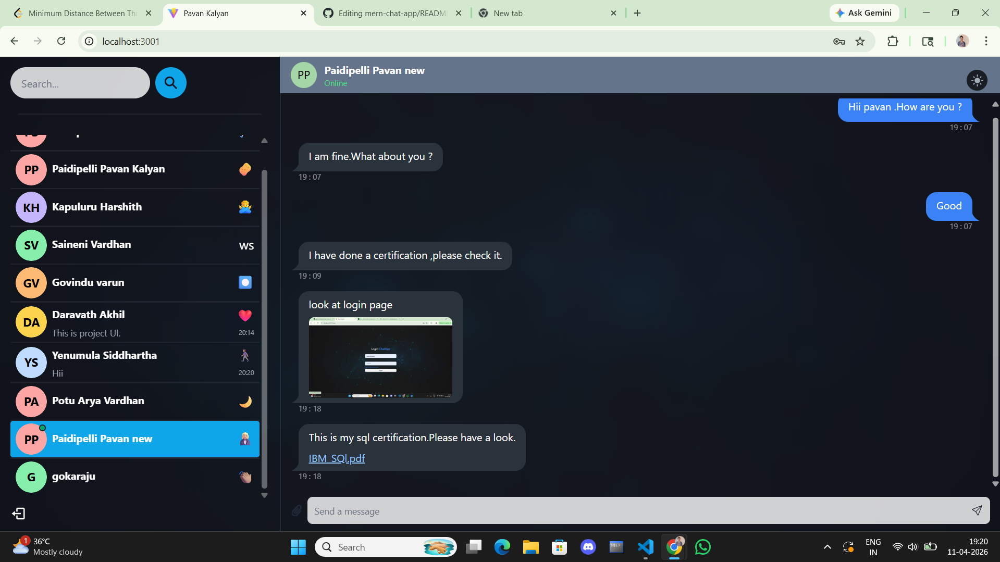
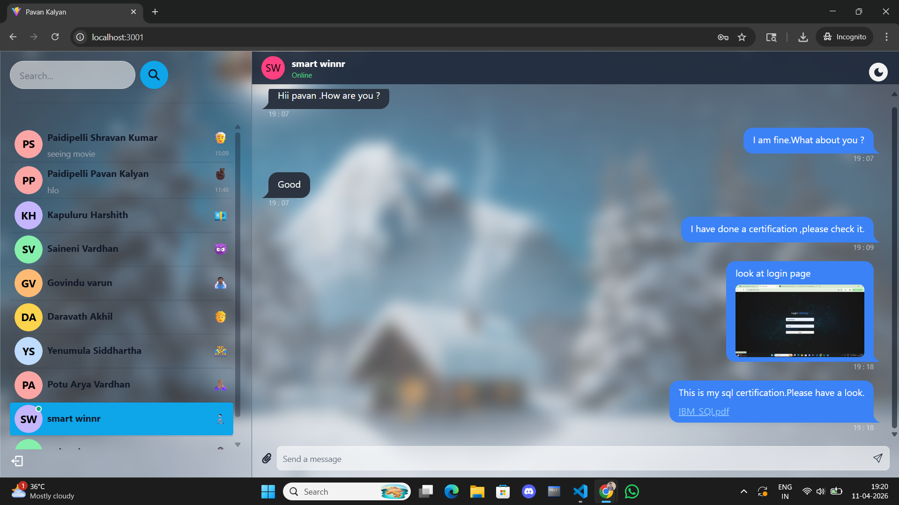

# SmartWinnr Chat App

A full-stack real-time chat application inspired by WhatsApp-style messaging.

This project allows users to create accounts, log in securely, chat with other users in real time, send text messages, share images/files, view online users, and receive instant notifications.

## Features

* User signup and login with JWT authentication
* Secure password hashing using bcrypt
* Real-time one-to-one messaging using Socket.IO
* Online/offline user status
* File and image sharing using Multer
* Notification sound for new incoming messages
* User avatars with initials and color generation
* Recent message preview in sidebar
* Last message timestamp display
* Responsive UI for desktop and mobile
* Protected routes using JWT middleware
* Search users and conversations
* Theme toggle for dark and light mode
* Dynamic sidebar conversation selection
* Real-time message updates without refreshing
* Auto scroll to latest messages
* Glassmorphism-based modern UI
* Mobile responsive chat layout similar to WhatsApp
* Conversation-based message history

## Tech Stack

### Frontend

* React.js
* Vite
* Tailwind CSS
* DaisyUI
* Zustand
* Socket.IO Client
* React Router DOM
* React Hot Toast
* React Icons

### Backend

* Node.js
* Express.js
* MongoDB Atlas
* Mongoose
* JWT Authentication
* BcryptJS
* Cookie Parser
* Multer
* Socket.IO
* CORS
* dotenv

## Folder Structure
#**backend structure**

# Frontend Structure

## Project Setup
### 1. Clone the Repository
git clone https://github.com/pavan123kalyan/mern-chat-app.git
cd mern-chat-app

### 2. Install Dependencies
Install backend dependencies:
npm install

**Install frontend dependencies**:
cd frontend
npm install
\## Required Versions
**Make sure the following versions are installed:**
1. Node.js : v18 or above
2. npm      : v9 or above
3. MongoDB  : MongoDB Atlas cloud database

**You can verify versions in terminal using:**
node -v
npm -v
**## Environment Variables**
Create a ".env" file inside the `backend` folder.
Example:
**.env**
MONGO_DB_URI=your_mongodb_connection_string
PORT=5000
JWT_SECRET=your_secret_key
NODE_ENV=development

## Running the Project
### Start Backend Server
**From the root folder:**
npm run server
**Backend will run on:**
http://localhost:5000

### Start Frontend
#Open a new terminal:
cd frontend
npm run dev
**Frontend will run on:
http://localhost:3000
If port 3000 is already busy, Vite may automatically use port 3001.

## Important Notes
* Keep both frontend and backend running together.
* Make sure MongoDB Atlas IP access is enabled.
* Create an `uploads` folder inside the backend directory for storing shared files.
* Add the following in `.gitignore`:
node_modules
.env
backend/uploads
frontend/dist

## Main Functionalities Implemented
### Authentication
* Signup
* Login
* Logout
* JWT-based protected routes

### Messaging
* Send text messages
* Real-time chat updates
* Store conversations in MongoDB
* Show latest message preview
* Display timestamp for latest message
* Auto scroll to newest messages

### Real-Time Features
* Online user tracking
* Socket.IO live updates
* New message sound notification
* Instant message delivery without page refresh

### File Sharing
* Send images
* Send documents/files
* Upload and store files locally using Multer
* Preview uploaded images inside chats

## Future Enhancements
* Group chat support
* Voice call feature
* Video call feature using WebRTC
* Message seen status
* Typing indicator
* Delete message option
* Chat wallpaper customization
* Chat room creation
* Emoji picker integration
* Pinned chats feature
* User profile editing

## Screenshots

### Login Page

### Signup Page

### Dark Theme 

### Light Theme

